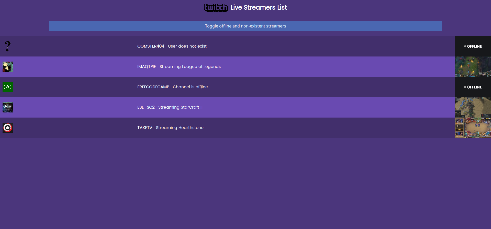
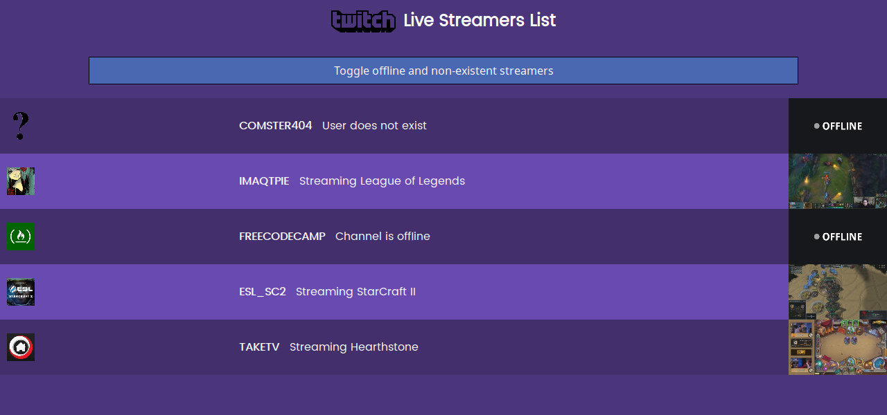
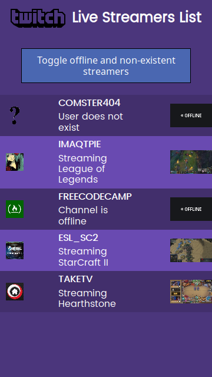

# twitch-json-api

> A FreeCodeCamp Challange

# Screenshots

### Desktop:



### Laptop:



### Mobile:



## Build Setup

Add your ClientID to the StreamersList Container.vue file.

``` bash
# install dependencies
npm install

# serve with hot reload at localhost:8080
npm run dev

# build for production with minification
npm run build
```
